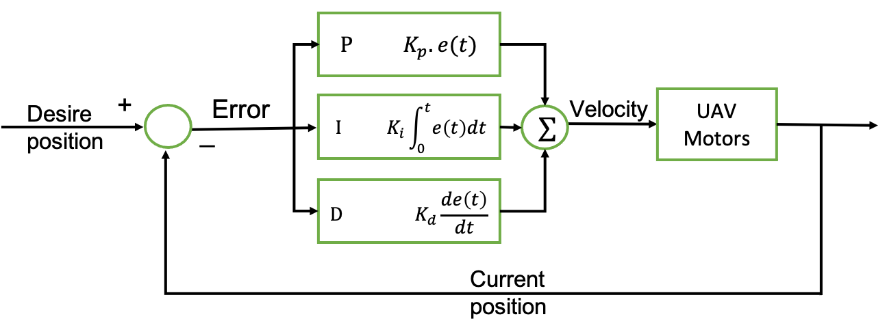

# offboard_velocity_control(PID)
OFFBOARD control is dangerous.

If you are operating on a real vehicle be sure to have a way of gaining back manual control in case something goes wrong.

## Installation
```
git clone https://github.com/ducanh1699/offboard_control.git
```

## Getting started
1. Launch a quadrotor with px4 and mavros in gazebo 
```
roslaunch px4 mavros_posix_sitl.launch 
```

2. Run the offboard_velocity_control
```
rosrun offboard_control offb_node
rosrun offboard_corol setmode_offb
```

## PID Controller
### Basis theory

PID controller is a proportional–integral–derivative controller (PID controller or three-term controller) is a control loop mechanism employing feedback loop. 


This based on the current position and target position to have velocity to control UAV. 
```
  x----------------------------x
current                      target
```
To understand clearly, you can refer to the wiki: https://en.wikipedia.org/wiki/PID_controller

And watch the video: https://www.youtube.com/watch?v=wkfEZmsQqiA&ab_channel=MATLAB

Necessary library include:
```
#include "offboard_control/pid_controller_base.h"
```
1. set-up PID coefficient
```
double kp = 0.4, ki = 0.0, kd = 3.4;
```

2. create pid command and pass the values above 
```
PidControllerBase pid_cmd(kp, ki, kd);
```
**Note: each pid_command have only use in one axis**

3. set-up max and min the velocity to fly UAV
```
pid_cmd.setUMax(max_v);
pid_cmd.setUMin(min_v);
```

